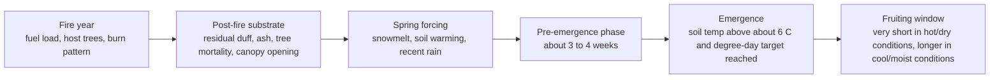

# Predictive Modeling for Burn-Scar Morel Mushrooms

## Executive summary

- The strongest directly supported predictors are **time since fire**, **local burn severity/forest-floor combustion**, **spring soil warming**, **recent precipitation/soil moisture**, and **microsite proximity to burned trees with thin residual duff**. Across post-fire studies, the dominant fruiting pulse is usually the **first post-fire season**, with reduced second-year production; morels were absent in one Yosemite plot study where **less than 50% of the ground surface had burned**, and clustered strongly at **less than 3 m**, with spatial signal extending to about **7 m**. citeturn29search3turn37view0turn38view3turn43search2

- The best-supported thermal cue is **soil warmth**, not a single air-temperature cutoff. Published field observations show morel fruiting can begin once soil temperature exceeds about **6.1 °C / 43 °F**, with onset also aligning with roughly **365 to 580 soil degree-days above 0 °C** in one long-term field study; the pre-emergence phase lasts about **3 to 4 weeks**, then expansion can be rapid once conditions are favorable. citeturn14view1turn14view3turn43search0turn12view0

- Moisture modulates whether that thermal signal produces mushrooms. In Missouri, abundance rose with **rain events greater than 10 mm** in the **30 days before fruiting**; in Alaska, **cool, overcast, moist** conditions extended pickable lifespan, while hot, dry weather shortened it, and an unusually wet May was followed by abundant fruiting the next month. citeturn12view0turn17view0turn17view1turn17view2

- Burn severity is not one-dimensional. Several western North American sources indicate peak production in the **moderate “red needle” zone** or where roughly **60% to 80% of duff was consumed**, yet the Yosemite study found strongest occurrence on nearly completely burned ground. A predictive model should therefore separate **canopy/tree mortality**, **surface burn fraction**, **duff consumption**, and **local ash/mineral-soil exposure** rather than collapsing severity to one class. citeturn15view0turn20view0turn11search3turn37view0turn38view3

- A practical modeling architecture is a **two-stage, multi-scale spatiotemporal model**: first, predict **where first-year burn morels are possible** at 10 to 30 m resolution; second, predict **when and how intensely they fruit** at the plot or transect level using repeated visits, soil sensors, and microsite covariates. This is justified by the observed mix of strong fire-level controls, high zero inflation, and fine-scale clustering. citeturn37view0turn43search2turn16view0

## Ecological signal and variable-by-variable evidence

Fire-adapted burn morels are concentrated in western North American conifer-burn systems. A 2017 taxonomic paper states that **five fire-adapted black morel species** had been documented in western North America and that their fruiting appears restricted to **conifer burn sites**, with eastern North American post-fire records much rarer. That means a model should treat **forest type and pre-fire host composition** as primary screening variables, not merely background covariates. citeturn29search3turn27search7

Vegetation matters biologically as well as structurally. In pure-culture synthesis, Morchella isolates formed ectomycorrhiza-like structures with **Larix occidentalis, Pinus contorta, Pinus ponderosa, and Pseudotsuga menziesii**, but not with *Arbutus menziesii*. Separately, Morchella was detected as an endophyte in cheatgrass, and one study reported increased cheatgrass biomass and fecundity from that association. The safest interpretation is that burn-morel nutritional ecology is flexible, so the model should include **pre-fire tree species**, **canopy condition**, and, where relevant, **post-fire grass invasion/regrowth**. citeturn41search4turn41search12

Fire alters substrate in ways that plausibly favor morels. A USDA synthesis reports that fire can reduce microbial biomass in the humus layer by roughly **30% to 85%**, sometimes persisting **5 years or more**, and that morels are often most abundant where **60% to 80% of the duff layer** was consumed. The same synthesis notes field reports of heavy fruiting in the **“red needle zone,”** where trees are killed but needles are not fully consumed. Mechanistically, that points to a variable set built around **duff loss**, **tree mortality**, **necromass formation**, and **canopy opening**, not just mapped severity class. citeturn15view0turn15view1

The strongest microsite evidence comes from post-fire field studies. In the Kootenay study, ascocarps were strongly biased toward **thin post-fire duff** and **proximity to standing burned trunks**, and the bases of ascocarps were consistently just below the **mineral-soil surface**. In the Yosemite study, morels occurred in **17.8%** of 1,119 plots, with a mean standing crop of **1,693 morels/ha**, and occupancy was strongly spatially autocorrelated at **less than 7 m**, especially **less than 3 m**. Those are direct arguments for adding **distance to burned stems**, **distance to prior detections**, **post-fire duff depth**, **surface mineral-soil exposure**, and **local spatial random effects**. citeturn43search2turn37view0

Thermal timing is best represented as a cumulative process. Published field observations summarized by the USDA report place initial fruiting above about **43 °F / 6.1 °C soil temperature**. The Missouri field study found onset at roughly **365 to 580 soil degree-days above 0 °C**, similar to the **425 to 580** range reported by Buscot, and showed that the day of initiation was inversely related to accumulated spring air and soil warmth. The same literature indicates a **3 to 4 week** pre-emergence phase, followed by **1 day** to reach roughly two-thirds of final size under optimal conditions and another **1 to 10 days** to mature. citeturn14view1turn14view3turn43search0turn12view0

Moisture gates the expression of that thermal signal. In Missouri, abundance rose with rain events over **10 mm** during the **30 days preceding fruiting**. In Alaska, cool overcast weather with moist soils prolonged development; a wet May, about **2 inches** versus a long-term mean of **0.6 inches**, was followed by abundant fruiting a month later. Rain can also be double-edged, stimulating additional fruiting while damaging standing mushrooms and speeding decay. For modeling, this supports **lagged precipitation totals**, **event counts above a threshold**, **vapor pressure deficit**, **surface soil moisture**, and **cloudiness or radiation** as separate predictors. citeturn12view0turn17view0turn17view1turn17view2

Topography mostly controls **timing** and **desiccation risk**, with less direct evidence for a universal directional effect on occurrence. The USDA synthesis notes that in mountainous terrain morels fruit first at **lower elevation** or on **south-facing slopes**, then later at **higher elevation** and on **north-facing slopes**, and that burned soils warm faster than unburned soils because their dark surface absorbs more radiation. In the Sierra Nevada section of that same report, fruiting in burned areas generally starts in early March at roughly **4,000 ft / 1,219 m** in the northern Sierra and **5,000 ft / 1,524 m** in the southern Sierra, then moves upslope; burned riparian forests in eastern drainages can also be productive. citeturn24view2turn24view3

The effect of **elevation** is therefore strongly regional and interacts with latitude and snowpack. Western Canada reports show production starting at lower elevations and southern latitudes and moving to higher and more northern sites through the season; high-elevation central British Columbia burns produced morels in **June through July**, while near Cranbrook fruiting ran from **early May to early August**, and near Yellowknife the season was reported as **July 1 to July 30**. Gray burn morels are also reported to be more abundant at **higher elevations and northern latitudes** and to fruit later than pink and green burn morels. citeturn24view1turn24view2

Direct burn-morel evidence for soil type and pH is sparse. The best quantitative ranges come from non-burn Morchella habitat studies, which found morels in **sandy loam to loamy soils**, at **slightly acidic to neutral pH** with one mean at **pH 6.4**, air temperatures of **13 to 27 °C**, soil temperatures of **6 to 26 °C**, and canopy cover averaging about **57%**; another site-based study reported a mean around **pH 7.4** and higher canopy cover. These findings are useful as weak priors, but they should not override direct burn variables because post-fire ash and combustion can transiently shift pH, texture expression, and organic-matter exposure. citeturn25search1turn25search3turn25search12

Evidence on **water bodies**, **forest edge**, and **post-fire regrowth** is weaker and more indirect. Productive burned riparian forests are documented in Sierra drainages; a Yellowknife study reported early-season morels in **wet habitats**, later-season fruiting in **transition zones**, and persistent fruiting on **dry ground** by another species. For edge effects, the best direct clue is that morels often occur in **sheltered microsites**, such as along logs or in depressions, where wind and sunlight are reduced. That makes **distance to streams**, **riparian mask**, **distance to forest edge**, **canopy openness**, and **depression or shelter index** reasonable exploratory variables, but currently lower-confidence than burn severity, soil warming, and tree proximity. citeturn24view3turn17view3turn21view0

A simple seasonal signal is:

This sequence is directly supported for temperature, growth timing, and seasonal compression or extension; the uncertainty is greatest in the substrate-to-emergence mechanism, not in the existence of the overall sequence. citeturn14view3turn12view0turn17view2turn43search2

### Temperature and moisture windows most useful for modeling

| Signal | Quantitative guidance | Modeling implication | Evidence |
|---|---|---|---|
| Soil temperature trigger | Fruiting begins once soil exceeds about **6.1 °C / 43 °F** | Use 5 cm and 10 cm soil temperature, plus threshold-crossing date | citeturn14view1turn14view3 |
| Cumulative warmth | Onset around **365 to 580 soil degree-days above 0 °C** in Missouri; similar to **425 to 580** reported earlier | Use cumulative soil GDD/HDD rather than one-day temperature | citeturn12view0turn43search0 |
| Primordia lag | Pre-emergence phase about **3 to 4 weeks** | Include lagged temperature and moisture windows, not same-day weather only | citeturn14view3 |
| Rain pulse | Abundance rises with **rain events greater than 10 mm** in prior **30 days** | Count threshold events and rolling rain totals at 7, 14, 30 d | citeturn12view0 |
| Window compression | Best fruiting years in one study had seasons only **6 to 7 days** | Revisit sites weekly or better; single-visit absence is weak evidence | citeturn12view0 |
| Window extension | Overall season about **2 to 6 weeks** in Alaska; cool moist weather extends lifespan | Add interaction terms for soil moisture × radiation or VPD | citeturn16view0turn17view2 |

## Comparison of major studies

| Study system | What was measured | Most useful quantitative findings | What it contributes to a model |
|---|---|---|---|
| entity["country","France","european country"], forest morels | Soil temperature and development | Fruiting above about **43 °F / 6.1 °C**; maturation rate linked to degree-days | Best direct basis for **soil-temperature thresholds** and growth lag citeturn14view1turn14view3 |
| entity["state","Missouri","US state"], 5-year woodland study | Air/soil temperature, rain, woody stems | Onset tied to **365 to 580 soil degree-days**; abundance higher after rain events **greater than 10 mm**; biggest years had **6 to 7 day** seasons | Strongest source for **phenology**, **rain lag**, and **tree proximity** logic, though not fire-specific citeturn12view0turn43search0 |
| northeastern entity["state","Oregon","US state"] burned vs healthy/insect stands | Stand-level productivity | First-year burned stands yielded about **127 to 1,761 morels/acre**, while healthy and insect-damaged stands were much lower; burn morels did not fruit in nonburned stands that year | Good baseline for **time-since-disturbance** and **habitat contrast** citeturn20view0 |
| entity["point_of_interest","Kootenay National Park","British Columbia, Canada"] and nearby burns | Duff depth, trunk proximity, year effects | Great majority of ascocarps in first post-fire summer; biased to **thin duff** and **near standing burned trunks**; fruiting bases just below mineral soil | Strongest direct evidence for **microsite covariates** citeturn43search2turn43search7 |
| interior entity["state","Alaska","US state"] | Productivity, weather, season, burn context | Fruit best near trees in **moderate to severe** burns; main season **late June to mid-July**, but overall **2 to 6 weeks**; cool moist/cloudy weather prolongs fruiting | Useful for **season length**, **tree proximity**, and **weather effects on persistence** citeturn16view0turn17view2turn17view3 |
| entity["point_of_interest","Yosemite National Park","California, US"] mixed-conifer burn | Plot occupancy and spatial autocorrelation | **595 morels** in **1,119 plots**; **17.8%** occupancy; **1,693 morels/ha**; no morels where **less than 50%** of the surface burned; clustering strongest at **less than 3 m** and present to **7 m** | Best direct evidence for **zero inflation**, **severity thresholding**, and **spatial terms** citeturn37view0turn38view3 |
| northern entity["country","Israel","middle eastern country"] burn | Post-fire forestry microsites | Stump clearing, **bulldozer compaction**, and **chopped wood cover** created preferred fruiting microsites; almost none on unburned soil | Supports **anthropogenic microsite disturbance** variables where relevant citeturn44search0 |
| entity["point_of_interest","Great Smoky Mountains National Park","Tennessee, US"] post-fire survey | Taxonomic identification | Post-fire morel discovered throughout a **severely burned area** after a 2016 fire; confirms eastern post-fire fruiting can occur though it is rare | Warning against assuming western-only models are globally transferable citeturn36search16turn29search3 |

## Modeling blueprint

The best design is a **nested model** with separate answers to two questions: **where can burn morels occur this week**, and **how many will fruit if they occur**. The Yosemite study shows why. Plot occupancy was only **17.8%**, yet nonzero plots showed tight spatial clustering. That favors a **two-part hurdle model** or **zero-inflated negative binomial** with **fire-level random effects** and **spatial terms**, rather than one global regression on counts. citeturn37view0

A practical workflow is: first, build a coarse screening model for **first-year conifer burns** using severity, elevation, aspect, burn age, riparian context, pre-fire vegetation, and weather history; second, within the shortlisted cells, model **weekly fruiting probability** from soil warming, recent rain, snowmelt timing, radiation, and surface moisture; third, estimate **local abundance** from microsite variables such as duff depth, ash/mineral-soil exposure, burned-tree proximity, and shelter. This mirrors the empirical signal in the published studies, where fire and substrate set the stage, then temperature and moisture gate emergence. citeturn43search2turn14view3turn12view0

### Feature list with variable types and suggested transformations

| Predictor | Scale | Suggested type or transform | Expected role | Evidence strength |
|---|---|---|---|---|
| Time since fire | fire, pixel | numeric; spline or bins for **year 1, year 2, year 3+** | Strongest first-year pulse, usually reduced after | Direct citeturn29search3turn16view0 |
| Burn severity | pixel, plot | continuous **dNBR/RdNBR** plus ordinal thematic class | Core filter, but nonlinear | Direct citeturn30search0turn30search4turn37view0turn38view3 |
| Surface burn fraction | plot | proportion 0 to 1 | Useful local severity term; hard threshold possible near **0.5** in one study | Direct citeturn38view3 |
| Duff consumption or residual duff depth | plot | continuous; consider piecewise threshold around thin duff | Very strong microsite predictor | Direct citeturn15view0turn43search2turn43search7 |
| Distance to burned tree base or standing burned trunk | plot | log1p distance | Higher probability close to trunks or tree bases | Direct citeturn43search2turn17view3 |
| Pre-fire host composition | pixel, stand | categorical type; tree basal area fractions | Restricts burn morels to suitable conifer systems | Direct to indirect citeturn29search3turn41search4 |
| Elevation | pixel | continuous; interact with latitude and snowpack | Mostly shifts season timing and species mix | Direct citeturn24view1turn24view2turn24view3 |
| Aspect | pixel | sine and cosine of aspect; or heat-load index | South/low earlier, north/high later | Direct but mostly for timing citeturn24view2 |
| Slope | pixel | continuous or spline | Proxy for drainage, insolation, snow persistence | Indirect citeturn24view2turn25search3 |
| Soil temperature at 5 and 10 cm | pixel or sensor | daily mean, threshold date, 7 d mean | Better than air temperature for onset | Direct citeturn14view1turn43search0 |
| Cumulative soil degree-days | week | cumulative above **0 °C**, optionally above **6 °C** | Strong onset feature | Direct citeturn43search0turn14view3 |
| Air temperature | weather station, grid | min, max, mean, 7 to 14 d trend, frost counts | Secondary to soil temp, still useful | Direct to indirect citeturn12view0turn25search3 |
| Precipitation | week | rolling totals at **7, 14, 30 d**; count of events **greater than 10 mm** | Moisture trigger and support | Direct citeturn12view0turn17view0 |
| Soil moisture | pixel or sensor | volumetric water content at 5 to 20 cm; anomalies | Supports emergence and persistence | Direct to indirect citeturn17view2turn35search1turn35search20 |
| Snowmelt timing | pixel | day-of-year of snow disappearance | Major timing control at elevation | Indirect but strong mechanistic proxy citeturn24view3turn31search5 |
| Distance to stream or riparian zone | pixel | log1p distance; binary riparian mask | Explains some productive wet drainages and seasonal succession | Indirect citeturn24view3turn17view3 |
| Soil texture, pH, organic matter | pixel | continuous; possibly depth-specific | Weak prior, likely region-specific | Indirect citeturn25search1turn45search0turn45search8 |
| Canopy opening or post-fire green-up | pixel | NDVI, EVI, canopy-cover delta | Proxy for shade, desiccation, regrowth | Indirect citeturn33search6turn33search9turn32search18 |
| Fuel load and fuel moisture | fire, station | dead-fuel moisture, canopy cover, biomass proxies | Helps explain severity and duff outcome | Indirect to direct citeturn34search0turn34search4turn32search7 |
| Microsite shelter | plot | depression index, log wind shelter, charred-log proximity | Morels favor sheltered positions | Direct but understudied citeturn21view0turn43search2 |

## Data sources and field sampling

### Recommended data sources

| Variable family | Preferred source | Typical resolution and scope | Why it fits this problem |
|---|---|---|---|
| Fire perimeter and burn severity | entity["organization","U.S. Geological Survey","federal science agency"] and MTBS, with Landsat severity products | MTBS is **30 m**, large fires in the U.S. from **1984 onward**; Landsat indices are also **30 m** | Best official source for **time since fire**, **dNBR/RdNBR**, severity class, and perimeter geometry citeturn30search0turn30search4turn33search1turn33search12 |
| Elevation, slope, aspect | USGS 3DEP in the U.S.; Copernicus DEM globally | 3DEP varies; Copernicus GLO-30 and GLO-90 are global | Core for elevation, heat load, drainage, and shelter derivation citeturn30search7turn45search2turn45search10 |
| Daily weather | Daymet from entity["organization","Oak Ridge National Laboratory","national lab Tennessee"]; PRISM at entity["organization","Oregon State University","Corvallis university"] for U.S. normals and daily data | Daymet **1 km** daily; PRISM **800 m and 4 km** daily and normals | Good coverage for temperature, precipitation, vapor pressure, radiation, snow water equivalent, and climatology citeturn30search1turn30search5turn30search2turn30search6 |
| Soil moisture and soil temperature | entity["organization","NOAA","US weather agency"] USCRN; entity["organization","USDA Natural Resources Conservation Service","federal soils agency"] SCAN; ERA5-Land; SMAP from entity["organization","NASA","US space agency"] | USCRN and SCAN are stations; ERA5-Land about **9 km** hourly; SMAP top **5 cm** every **2 to 3 days** | Necessary for the most important short-term forcing variables; in-situ data are best for calibration, gridded data for mapping citeturn35search0turn35search1turn35search20turn35search3turn31search1turn31search15 |
| Vegetation and canopy cover | LANDFIRE EVT and EVC; FIA for tree composition; NLCD for land cover | LANDFIRE and NLCD are **30 m**; FIA is plot-based | Best official combination for host composition, canopy cover, forest type, and pre-fire fuels proxies citeturn32search0turn32search3turn32search18turn32search2turn32search10turn32search1 |
| Water bodies and hydrography | National Hydrography Dataset in the U.S.; HydroSHEDS globally | Vector hydrography and gridded hydro layers | For distance-to-stream and riparian masks citeturn30search3turn45search1turn45search9 |
| Soils | gSSURGO and SSURGO in the U.S.; SoilGrids globally | gSSURGO is gridded national raster; SoilGrids **250 m** with depth layers | Supplies pH, texture, organic carbon, CEC, and depth-specific soil attributes citeturn30search15turn30search23turn45search0turn45search8 |
| Snow timing and seasonal persistence | MODIS or VIIRS snow products | **500 m** to coarser daily and composite products | Valuable in montane systems where fruiting tracks snowline retreat | citeturn31search2turn31search5turn31search12 |
| Fuel moisture and station weather | RAWS and FEMS | Hourly station data and mapped fuel-moisture products | Bridges fire-weather context and short-term desiccation risk | citeturn34search0turn34search1turn34search4 |

### Recommended sampling design

Use **stratified repeated-visit field sampling**, not opportunistic presence-only data. A good template is the Yosemite design of many small georeferenced plots, because it yielded unbiased abundance and clustering estimates. For each fire, stratify by **severity**, **elevation band**, **aspect**, **riparian distance**, and **forest type**. Within each stratum, place transects and **circular plots near 3.14 m²** or fixed-width belt transects, and revisit every **5 to 7 days** through the expected fruiting period. citeturn37view0turn12view0

At each plot, record both **presence and true absence** plus microsite covariates: residual duff depth, ash depth or cover, percent mineral-soil exposure, distance to nearest burned bole and nearest tree base, canopy openness, downed charred wood, soil disturbance, topographic shelter, and visible post-fire regrowth. Install low-cost temperature and moisture sensors at representative plots, ideally at **5 and 10 cm** depths, because these depths align with available climate-network products and the published thermal literature. citeturn43search2turn21view0turn35search1turn35search20

For species resolution, voucher a subset of collections and barcode them. Many abundance studies worked only at the genus level, but the literature shows species turnover by region, habitat moisture, and season. Without molecular validation, a model may unintentionally learn pooled responses from multiple burn-morel taxa. citeturn37view0turn17view3turn29search3

Validation should be **leave-one-fire-out**, then **leave-one-region-out** if enough fires are available. Spatial blocking is mandatory because morels are clustered at a few meters, and random train-test splits within a fire will overstate performance. The right scoring outputs are calibration and search-efficiency metrics, for example **top-decile hit rate**, **occupied-plot recall**, and **distance saved per detected cluster**, not only AUC. citeturn37view0

## Uncertainty, conflicting findings, and gaps

The main conflict is the meaning of “best severity.” Several western sources favor **moderate burns** or **moderate duff consumption**, but the Yosemite study found strongest occurrence on nearly fully burned surface plots and none below **50%** surface burn. Those findings are not actually incompatible if one study is capturing **tree mortality with partial surface retention** and another is capturing **surface burn fraction at plot scale**. A serious model should therefore include **multiple severity measurements at multiple scales**. citeturn15view0turn20view0turn11search3turn38view3

The next major gap is that several variables in forager lore remain weakly quantified in the literature: **forest edge distance**, **distance to water**, **ash depth**, **charred wood amount**, **post-fire regrowth**, and **soil pH shifts in actual burn-morel microsites**. These belong in field protocols now, even if they begin as exploratory variables, because the current literature is too sparse to exclude them confidently. citeturn21view0turn24view3turn44search0turn25search1

A third uncertainty is trophic mode. Morels show evidence of mycorrhiza-like relations with conifers, possible endophytic behavior in grasses, and strong responses to disturbance and dead organic matter. That flexibility likely explains why host, fuel, and substrate variables all matter, but it also means models trained in one forest type may transfer poorly to another if the dominant morel taxon or nutritional mode differs. citeturn41search4turn41search12turn29search3

The final gap is sample size. Even in 2026, the peer-reviewed literature still contains only a small number of unbiased post-fire abundance studies. That means a predictive system should be viewed as **regionally calibrated and updateable**, with posterior updating after each field season, rather than as a finished universal model. citeturn37view0turn23search0